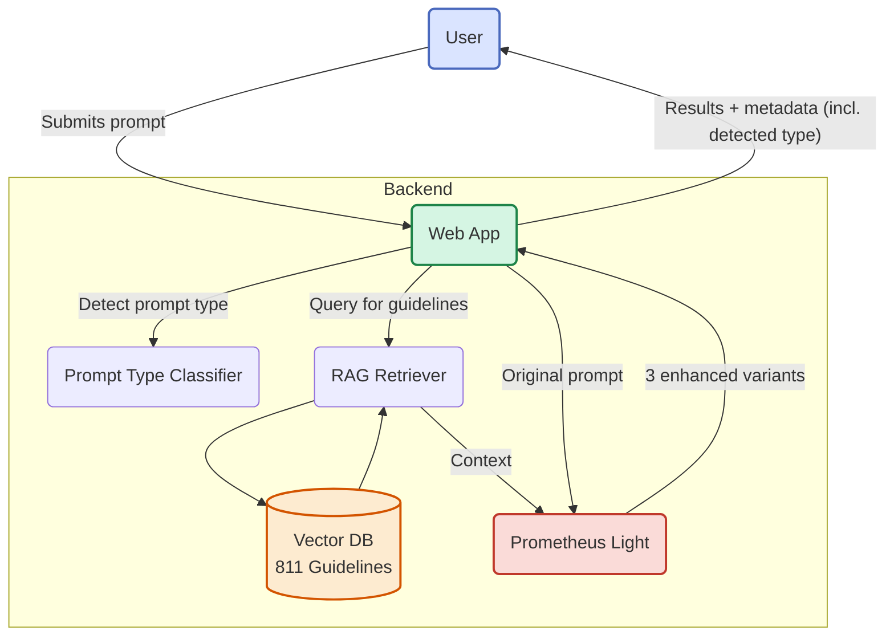

# Project Prometheus

An intelligent prompt augmentation engine that helps you get better results from any Large Language Model.

[](https://opensource.org/licenses/MIT)
[](https://github.com/Tech-Society-SEC/Prometheus)

## What is this?

If you've ever felt frustrated trying to get good results from ChatGPT, Claude, or Gemini, you're not alone. The quality of AI responses depends heavily on how you phrase your questions. Prometheus acts as your personal prompt engineer, automatically improving your prompts based on hundreds of best practices specific to each AI model.

Think of it as a translator that speaks fluent "AI" so you don't have to.

## Why we built this

Getting good results from AI shouldn't require a PhD in prompt engineering. We wanted a tool that:
- Works instantly without heavy GPU requirements
- Knows the quirks of different AI models (ChatGPT likes structure, Claude prefers XML tags, etc.)
- Generates multiple variations so you can pick what works best
- Runs anywhere—your laptop, a server, or a container

After hitting GPU memory constraints with traditional approaches, we built a hybrid system that combines vector search with pattern-based generation. It gives you 80% of the quality with 1% of the resource requirements.

## Getting started

**Requirements:**
- Python 3.11 or newer
- Node.js 18 or newer  
- At least 2GB RAM

**Local setup:**

```bash
# Clone the repo
git clone https://github.com/Tech-Society-SEC/Prometheus.git
cd Prometheus

# Start the backend
cd backend
python -m venv .venv
source .venv/bin/activate  # Windows: .venv\Scripts\activate
pip install -r requirements.txt
uvicorn app.main:app --reload --port 8000

# In a new terminal, start the frontend
cd frontend
npm install
npm run dev
```

Open http://localhost:5173 in your browser. You should see the prompt interface.

**Using Docker:**

```bash
docker-compose up --build
```

Same result, less setup.

## How it works

When you submit a prompt, Prometheus:

1. Detects the prompt type (code, analysis, explain, creative, summarize, troubleshoot)
2. Searches 811 curated prompt-engineering guidelines and picks those relevant to that type
3. Generates enhanced variations using type-specific structures (no user model selection needed)
4. Returns all versions with metadata so you can see what changed

We use ChromaDB for vector similarity search and sentence-transformers for embeddings. The enhancement logic uses lightweight templates informed by training experiments, but runs without needing a GPU at inference time.

<details>
<summary>System diagram</summary>



</details>

## Using the API

**Enhance a prompt:**

```bash
curl -X POST http://localhost:8000/augment \
  -H "Content-Type: application/json" \
  -d '{
    "raw_prompt": "Explain quantum computing",
    "num_variations": 3
  }'
```

**Response:**

```json
{
  "enhanced_prompts": [
    "You are an expert assistant specializing in quantum physics...",
    "Task: Provide a comprehensive explanation of quantum computing...",
    "Help me understand quantum computing. Include: basic principles..."
  ],
  "original_prompt": "Explain quantum computing",
  "detected_prompt_type": "explain",
  "model_type": "lightweight",
  "rag_context_used": true,
  "rag_chunks_count": 5
}
```

**Check system health:**

```bash
curl http://localhost:8000/health
```

## Supported prompt types

- **Code** — snippets, debugging, refactors
- **Analysis** — comparisons, evaluations, trade-offs
- **Explain** — overviews, definitions, walkthroughs
- **Creative** — stories, taglines, scripts, lyrics
- **Summarize** — TL;DR, key points, concise recaps
- **Troubleshoot** — errors, exceptions, why it fails
- **Other** — fallback when no strong match

## Project structure

```
backend/
  app/
    main.py           # API endpoints
    model/            # Inference engine
    rag/              # Vector database and retrieval
frontend/
  src/
    components/       # UI components
    api/              # API client
    styles/           # Themes and styling
services/
  ingest/             # Data pipeline for guidelines
docs/                 # Documentation
docker-compose.yml    # Container orchestration
```

## Fine-tuning (optional)

The current system uses Prometheus Light, which works great for most cases. If you have access to better hardware (16GB+ RAM, 8GB+ VRAM), you can train the full fine-tuned model:

1. Open `Fine_Tune_Prometheus.ipynb` in Google Colab
2. Upload your training dataset
3. Run the notebook to train LoRA adapters
4. Download adapters to `backend/app/model/prometheus_lora_adapter/`
5. Update `backend/app/model/inference.py` to load the full model

Check `backend/README.md` for details.

## Known limitations

- CPU inference is slower than GPU (expect 2-5 second response times)
- The lightweight model works well for common prompts but may miss nuances in highly specialized domains
- Currently English-only
- No streaming support yet

## Contributing

Found a bug? Have a feature idea? Pull requests are welcome. For major changes, open an issue first so we can discuss.

## License

MIT License - see [LICENSE](LICENSE) for details.

## Credits

Built with FastAPI, React, ChromaDB, and Sentence Transformers. Guidelines sourced from OpenAI, Anthropic, and Google documentation. Base model: Mistral-7B-Instruct-v0.1.

---

**Current version:** 1.0 | **Model:** Prometheus Light v1.0
