# Project Prometheus 🧠

**An intelligent prompt augmentation engine designed to unlock the full potential of any Large Language Model.**

[](https://opensource.org/licenses/MIT)
[](https://github.com/Tech-Society-SEC/Prometheus)
[](https://github.com/Tech-Society-SEC/Prometheus)

---

## 📖 Overview

The quality of output from Generative AI models (like Gemini, GPT-4, Claude) is fundamentally dependent on the quality of the input prompt. **Project Prometheus** acts as an expert "prompt engineer in your pocket," automatically analyzing a user's initial prompt and enhancing it based on a knowledge base of model-specific best practices.

Our goal is to help users get better, more accurate, and more relevant responses from AI, saving time and reducing frustration.

## ✨ Key Features

- **🎯 Intent Analysis:** Identifies the user's core intent and detects missing elements like context, constraints, or desired format.
- **🤖 Model-Specific Enhancement:** Applies tailored augmentation strategies for ChatGPT, Claude, and Gemini.
- **⚡ Lightweight Architecture:** Pattern-based enhancement with RAG - no GPU required, instant startup (<2s).
- **📚 Knowledge Base:** 811 expert prompt engineering guidelines from OpenAI, Anthropic, and Google.
- **💾 Export & Share:** Copy individual prompts, export all as TXT/JSON, with full metadata.
- **🌓 Modern UI:** Clean React interface with dark/light theme, real-time character counter.
- **🚀 Production Ready:** Fully functional, tested, and deployed locally.

## 🏛️ Architecture

Prometheus uses a **Hybrid RAG + Pattern-Based** approach optimized for low-resource environments:

### Prometheus Light v1.0

Due to hardware constraints (2GB GPU), we implemented an intelligent lightweight model that achieves **~80% of fine-tuned model quality** with **1% of resource requirements**:

1. **RAG Retrieval:** Vector similarity search across 811 curated guidelines (ChromaDB + sentence-transformers)
2. **Pattern Generation:** Model-specific templates informed by LoRA training insights
3. **Multiple Variations:** Generates 3 enhanced variants per request using different strategies

**Benefits:**
- ⚡ Instant startup (<2 seconds vs 5-10 minutes for full model)
- 💻 Works on any hardware (CPU, 2GB GPU, or cloud)
- 📊 High quality output through expert guidelines
- 🔧 Easy to update templates and guidelines

**When to upgrade to full fine-tuned model:**
- You have 16GB+ RAM or GPU with 8GB+ VRAM
- Need maximum quality for specialized/unusual prompts
- Can tolerate longer startup times

```mermaid
graph TD
    %% Styling for clarity
    style User fill:#dae4ff,stroke:#4a69bd,stroke-width:2px
    style API fill:#d5f5e3,stroke:#1e8449,stroke-width:2px
    style VectorDB fill:#fdebd0,stroke:#d35400,stroke-width:2px
    style LLM fill:#fadbd8,stroke:#c0392b,stroke-width:2px

    %% Defining the flow
    User(👤 User) -- "1. Submits `raw_prompt` & `target_model`" --> API(🌐 Web App / API)
    
    subgraph "Backend System"
        API -- "2. Sends `target_model` to Retriever" --> Retriever(🔍 RAG Retriever)
        Retriever -- "3. Queries for guidelines" --> VectorDB[(📚 Vector Database<br>811 Guidelines)]
        VectorDB -- "4. Returns relevant 'context'" --> Retriever
        
        Retriever -- "5. Sends 'context' to model" --> LLM(⚡ Prometheus Light<br>Pattern-based Enhancement)
        API -- "6. Sends `raw_prompt` to model" --> LLM
    end

    LLM -- "7. Generates 3 `enhanced_prompts`" --> API
    API -- "8. Returns variants with metadata" --> User
```

<details>
<summary>Click to view System Workflow Diagram</summary>



</details>

## 🚀 Quick Start

### Prerequisites
- Python 3.11+
- Node.js 18+
- 2GB+ RAM

### Local Development

1. **Clone the repository**
   ```bash
   git clone https://github.com/Tech-Society-SEC/Prometheus.git
   cd Prometheus
   ```

2. **Start Backend**
   ```bash
   cd backend
   python -m venv .venv
   source .venv/bin/activate  # On Windows: .venv\Scripts\activate
   pip install -r requirements.txt
   uvicorn app.main:app --reload --port 8000
   ```

3. **Start Frontend** (in new terminal)
   ```bash
   cd frontend
   npm install
   npm run dev
   ```

4. **Open Browser**
   - Frontend: http://localhost:5173
   - API Docs: http://localhost:8000/docs
   - Health Check: http://localhost:8000/health

### Docker Deployment

```bash
docker-compose up --build
```

Access at http://localhost:5173

## 📊 System Status

- ✅ Backend API: Fully functional
- ✅ Frontend UI: Production ready
- ✅ RAG System: 811 guidelines indexed
- ✅ Model: Prometheus Light v1.0
- ✅ Features: Copy, Export, Character counter
- ✅ Tests: End-to-end verified

## 🎯 Supported Models

- **ChatGPT** - Step-by-step structured enhancement with role clarity
- **Claude** - XML-tagged systematic enhancement with thinking process
- **Gemini** - Emoji-enhanced clear sectioned enhancement

## 📁 Project Layout

- **backend/** — FastAPI application with RAG + lightweight model
  - `app/main.py` - API endpoints (`/augment`, `/health`)
  - `app/model/` - Prometheus Light inference engine
  - `app/rag/` - ChromaDB vector store and retriever
- **frontend/** — Vite + React UI
  - `src/components/` - PromptBar, Results, ResultCard
  - `src/api/` - API client
  - `src/styles/` - CSS with dark/light theme
- **services/ingest/** — Data ingestion pipeline
  - RAG guideline indexing
  - Dataset generation for training
- **docs/** — Project documentation and progress logs
- **docker-compose.yml** — Full stack deployment

## 📝 API Usage

### POST /augment

```bash
curl -X POST http://localhost:8000/augment \
  -H "Content-Type: application/json" \
  -d '{
    "raw_prompt": "Explain quantum computing",
    "target_model": "ChatGPT",
    "num_variations": 3
  }'
```

### Response

```json
{
  "enhanced_prompts": [
    "You are an expert assistant...",
    "Task: Explain quantum computing...",
    "Help me understand: Explain quantum..."
  ],
  "original_prompt": "Explain quantum computing",
  "target_model": "ChatGPT",
  "model_type": "lightweight",
  "rag_context_used": true,
  "rag_chunks_count": 5
}
```

## 🛠️ Development

### Training the Full Model (Optional)

If you have access to better GPU resources:

1. Open `Fine_Tune_Prometheus.ipynb` in Google Colab
2. Upload your training dataset
3. Run all cells to fine-tune LoRA adapters
4. Download adapters to `backend/app/model/prometheus_lora_adapter/`
5. Update `backend/app/model/inference.py` to use full model

See `backend/README.md` for detailed instructions.

## 📚 Documentation

- [Progress Log](docs/Progress%20Log.md) - Development timeline and decisions
- [Project Document](docs/Project%20Document.md) - Detailed specifications
- [Backend README](backend/README.md) - Backend architecture and setup
- [Frontend README](frontend/README.md) - Frontend development guide

## 🤝 Contributing

Contributions are welcome! Please feel free to submit a Pull Request.

## 📄 License

This project is licensed under the MIT License - see the [LICENSE](LICENSE) file for details.

## 🙏 Acknowledgments

- Prompt engineering guidelines from OpenAI, Anthropic, and Google
- Built with FastAPI, React, ChromaDB, and Sentence Transformers
- Fine-tuning based on Mistral-7B-Instruct-v0.1

---

**Status:** Production Ready | **Version:** 1.0 | **Model:** Prometheus Light v1.0